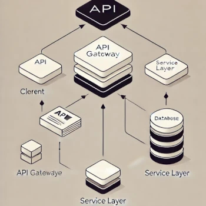

# API Medical Control

    
    
    
    
    

## Sobre o Projeto
Esta API foi projetada para integrar projetos que exigem o gerenciamento de posts, como blogs e sistemas de publicação de conteúdo. Embora ainda em desenvolvimento, a API visa fornecer um CRUD robusto, permitindo a criação, leitura, atualização e exclusão de posts. Além das operações básicas, a API será equipada com funcionalidades avançadas, incluindo paginação eficiente de dados e autenticação de usuários. O objetivo final é oferecer uma solução completa e escalável que possa ser facilmente integrada a diferentes tipos de aplicações.

## Tecnologias

    A API foi desenvolvida em python, utilizando o fastapi com a extesão do sqlalchemy como ORM para facilitar a interação com o banco de dados. A aplicação será deployada no Google Cloud, com uma base de dados postgress gerenciada pelo SQL Cloud. Durante o desenvolvimento, o Docker foi empregado para realizar testes e fazer uma base de dados virtual para não gerar custos adicionais no momento do desenvolvimento, além de gerenciar os ambientes e containers no momento de colocar a aplicação em produção, assegurando consistência e isolamento dos serviços.

